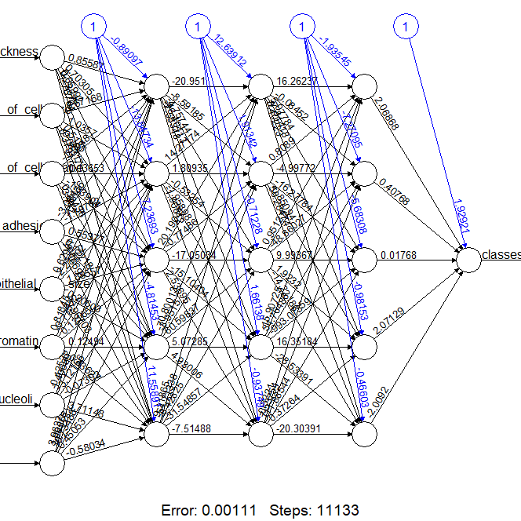
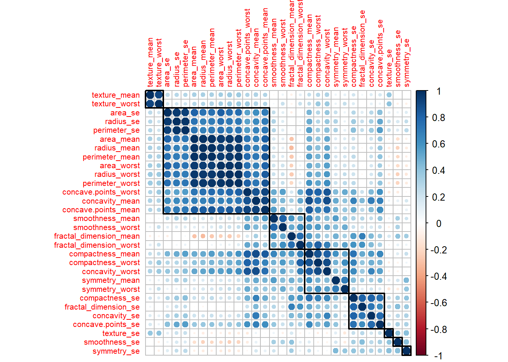
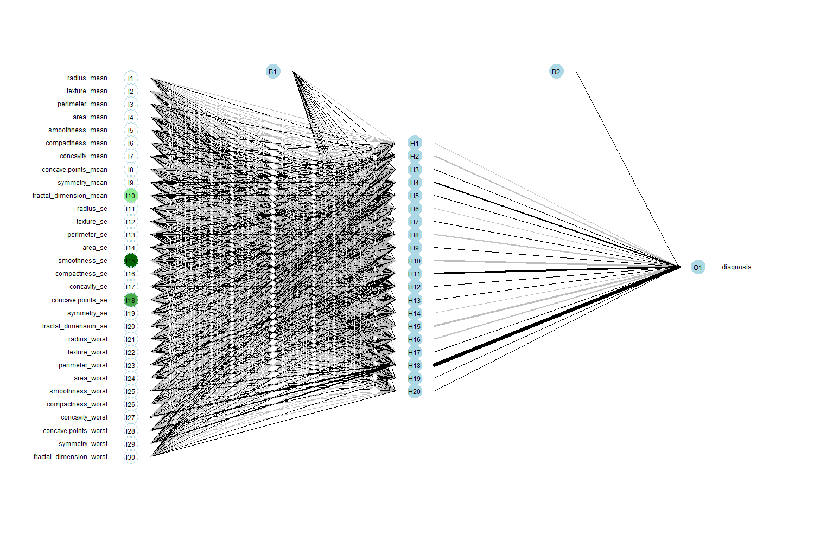
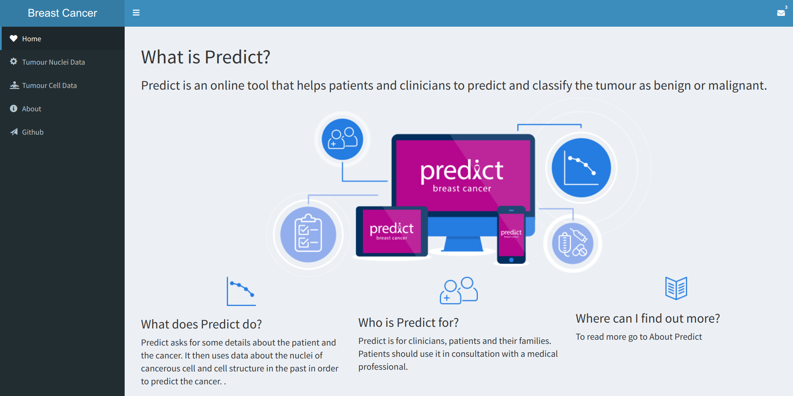
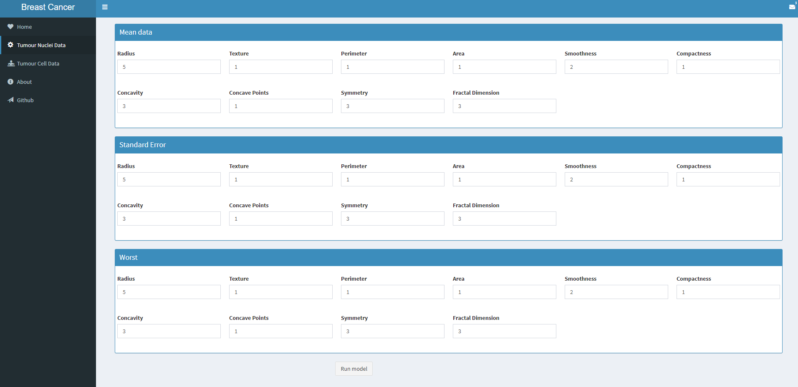
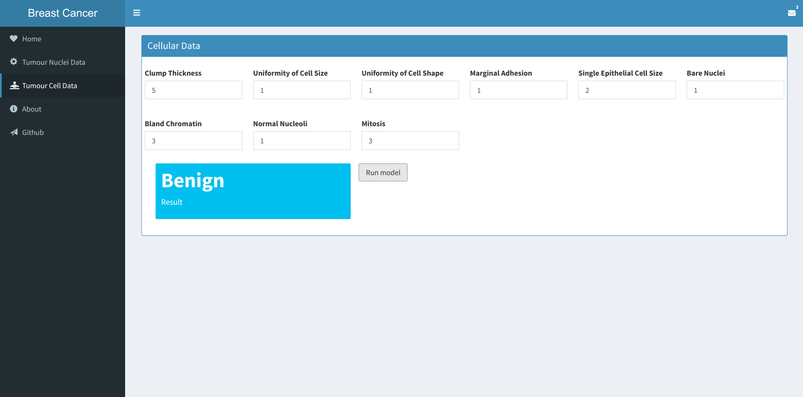

# Prediction of Breast Cancer
The breast cancer is becoming a serious issue between the women. One woman will die of breast cancer every 13 minutes. The diagnosis of the breast cancer is a complex task and takes time for the doctor to chack and analyze the lab results. Here we predict the breast cancer on its initial stages, with the lab results. This repo can be categorized to be
- Research
     It comprises of analyzing the data with various methodologies and applying different algorithms to improve the
     efficieny of the requirement.
- Web Application
     Based on the research, the web application is created.
## Getting Started
Clone this repository and get started
```sh
$ git clone https://github.com/SridharCR/Breast-Cancer-Predictor.git
```

Run app with RStudio for dev purposes.

### Prerequisties
Your workstation should have the following tools and softwares
- R 3.5.x
- RStudio
- Install required packages

## Directory Breakdown
* data - Breast cancer data set in Comma Separated Values(CSV) format.
* Predictor - Web application to predict the breast cancer both original and diagnostic.
* resources - System generated figures and other stuff required in RMD.

## Exploratory Data Analysis Summary:
This project focussed on 2 relevant datasets related to breast cancer. They belong from Wisconsin medical center.
The summary for the exploratory data analysis are as follows,
- ### Breast cancer Original data:
  The attributes information of the dataset are as follows,
    - sample_code_number
    - clump_thickness
    - uniformity_of_cell_size
    - uniformity_of_cell_shape
    - marginal_adhesion
    - single_epithelial_cell_size
    - bare_nuclei
    - bland_chromatin
    - normal_nucleoli
    - mitosis
    - result
  ### Model Info:   
     The neural network is used to classify the result from the input attributes.
     
     - Input layer = 1 layer with 1d of input attributes
     - Hidden layer = 3 layer with 1d of 5 neurons (3 x 5 = 15)
     - Output layer = 1 layer with 1 neuron

     **Neural network visualization:**
     

- ### Breast cancer Diagnostic data
  - radius (mean of distances from center to points on the perimeter)
  - texture (standard deviation of gray-scale values)
  - perimeter
  - area
  - smoothness (local variation in radius lengths)
  - compactness (perimeter^2 / area - 1.0)
  - concavity (severity of concave portions of the contour)
  - concave points (number of concave portions of the contour)
  - symmetry
  - fractal dimension ("coastline approximation" - 1)

  ### Data insights:
     Visualization of correlation matrix
     

  ### Model Info:   
     The neural network is used to classify the result from the input attributes.
     
     - Input layer = 1 layer with 1d of input attributes
     - Hidden layer = 1 layer with 1d of 20 neurons
     - Output layer = 1 layer with 1 neuron

     **Neural network visualization:**
     

  Check ./research/diagnostic data/breast-cancer-dataset-analysis-diagnostic-data.Rmd file for more explained EDA.

## Web Application
This application helps the people to identify the whether the tumour mass on the breast region is benign or malignant. As per above information, this application tends to resolve this conflict with 2 types of data. Here is the home page of the application.





1. Tumour nuclei data - Features are computed from a digitized image of a fine needle aspirate (FNA) of a breast mass. They describe characteristics of the cell nuclei present in the image. (Check Diagnostic data)

The page would look something like this




2. Tumour cell data - The observed attributes of the tumour cells. (Check Original data)

The page would look something like this



## Version
- Version 1.0 - Jan 2019
- Version 2.0 - Jun 2021

