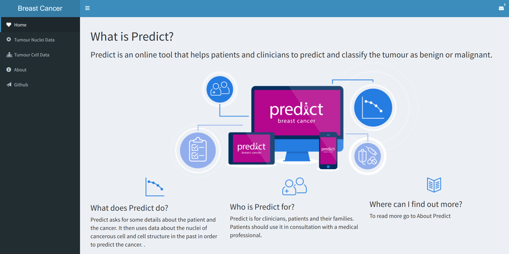
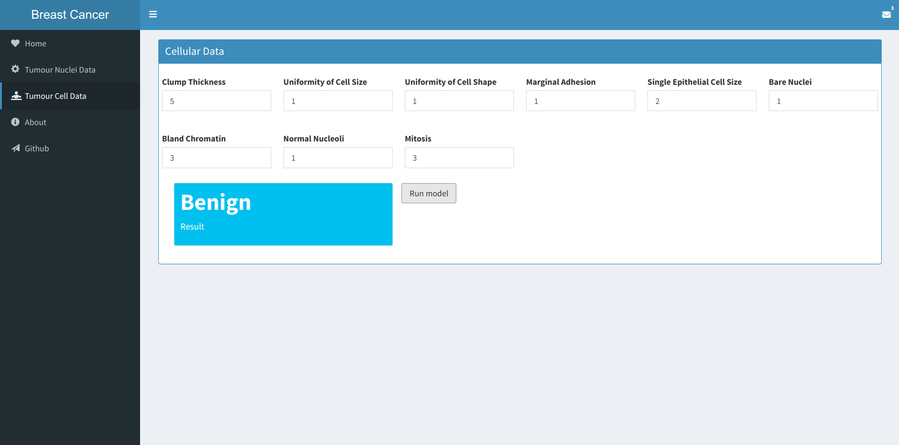

# Prediction of Cancer
The breast cancer is becoming a serious issue between the women. One woman will die of breast cancer every 13 minutes. The diagnosis of the breast cancer is a complex task and takes time for the doctor to chack and analyze the lab results. Here we predict the breast cancer on its initial stages, with the lab results. This repo can be categorized to be
- Research
     It comprises of analyzing the data with various methodologies and applying different algorithms to improve the
     efficieny of the requirement.
- Web Application
     Based on the research, the web application is created.
## Getting Started
Clone this repository and get started
```sh
$ git clone https://github.com/SridharCR/Breast-Cancer-Predictor.git
```

### Prerequisties
Your workstation should have the following tools and softwares
- R 3.5.x
- RStudio

## Directories
* Data - Data are stored in Comma Separated Values(CSV).
* Knitted Files - It contains the reports of the research in HTML,PDF formats.
* Predictor - It comprises of the web app
* Data_Analysis_files - System generated figures and other stuff required in RMD.

## Screenshots of the web app






## End Notes
This project is in development stage. Watch this repo to get notified.
 Contributions are welcomed!
